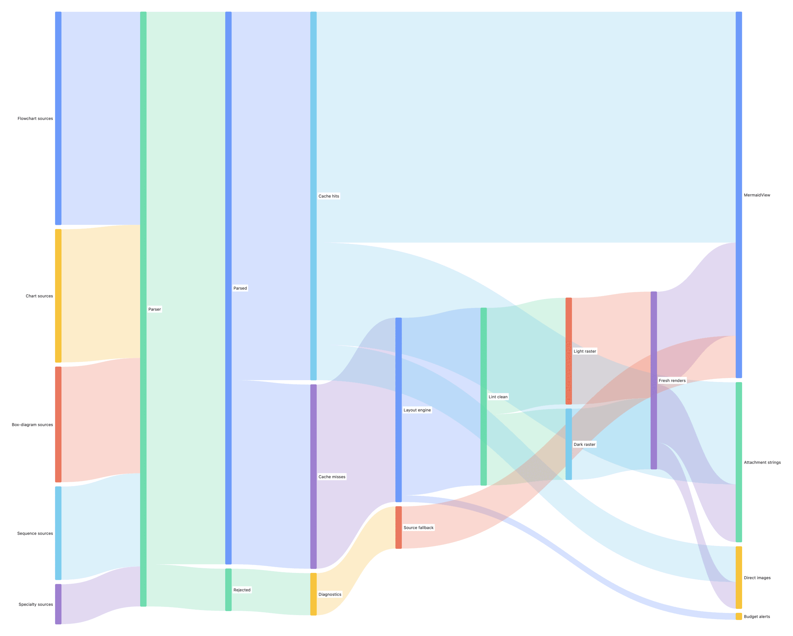

# MermaidKit

Native [Mermaid](https://mermaid.js.org) diagrams for Apple platforms — no
JavaScript, no WebView, no dependencies. Parse, lay out, and render **30
Mermaid diagram types** in pure Swift and CoreGraphics.

<picture>
  <source media="(prefers-color-scheme: dark)" srcset="docs/images/hero-dark.png">
  
</picture>

```swift
import MermaidRender

struct ReleaseFlow: View {
    var body: some View {
        MermaidView("""
        flowchart TD
            A[Start] --> B{Choice}
            B -->|yes| C[Do it]
            B -->|no| D[Skip]
        """)
    }
}
```

`MermaidView` follows the environment's light/dark scheme, sizes to the
diagram (scaling down, never up), and degrades unrecognized sources to
readable monospaced text. Prefer images? One call:

```swift
let image = MermaidRenderer.image(
    source: "sequenceDiagram\n  Alice->>Bob: Hello",
    theme: DiagramTheme(prefersDark: false)
)
```

## Why

Embedding Mermaid today usually means shipping mermaid.js inside a
`WKWebView`: a JS runtime per diagram, async round-trips, non-native text,
and a web process in your memory footprint. MermaidKit renders the same
source natively and synchronously — every diagram type below renders cold in
**under 36 ms** on Apple silicon, most in **under 12 ms**, and results are
cached per (source, theme, spacing).

|  | MermaidKit | mermaid.js + WKWebView | [BeautifulMermaid](https://github.com/lukilabs/beautiful-mermaid-swift) |
|---|---|---|---|
| Diagram types | **30** | all | 6 |
| Runtime | Swift + CoreGraphics | JS engine + web process | Swift (elk-swift layout) |
| Dependencies | **none** | mermaid.js bundle | elk-swift |
| Rendering | sync, ~ms, cached | async round-trip | sync + async |
| Output | `NSImage`/`UIImage`, `NSAttributedString`, SwiftUI | HTML/SVG in webview | image, SVG, ASCII |
| Layout engine | network-simplex layering, label-space reservation, fixed-side ports | dagre / ELK | elk-swift |
| Layout verification | **geometric linter in CI** + stability tests | — | — |
| Density control | `DiagramSpacing` presets | config | — |
| Syntax coverage | core syntax per type (see matrix) | reference | core syntax, 6 types |

If you need SVG output, iOS 15, or pixel-parity with mermaid.js, those other
rows are good choices. MermaidKit's bet is breadth of *native* type coverage
with zero dependencies and machine-checkable layout quality.

## The full set

Every type, rendered by MermaidKit itself, one image per diagram (light and
dark): **[docs/GALLERY.md](docs/GALLERY.md)**.

## Supported diagram types — honestly

All 30 types parse their **core syntax** — the constructs in the mermaid.js
docs' primary examples, which is what the dense fixtures in
`Fixtures/diagrams/` exercise. MermaidKit is not a syntax-complete port of
mermaid.js, and the failure mode is deliberate:

- **Unknown diagram dialects** → `MermaidParser.parse` returns `nil`; hosts
  show the fenced source (that's what `MermaidView` does), and
  `MermaidParser.diagnose` explains why — with a did-you-mean for typos.
- **Styling/interaction directives** (`%%{init:}%%`, `classDef`/`class`,
  `style`, `linkStyle`, `click`) → **ignored, not fatal**: the diagram still
  parses and renders with MermaidKit's own theme. Ditto comments (`%%`).
- **Structural syntax that goes beyond the core** — much of it works:
  YAML front-matter; flowchart chained edges (`A --> B --> C`), `&`
  fan-out, inline `-- text -->` labels, bidirectional `<-->`, min-length
  links, `:::class` tolerance; sequence activation shorthand (`->>+`),
  cross/async arrows (`-x`, `-)`), `autonumber`, aliases; gantt directive
  lines (never phantom bars) and `y/M/s` durations; radar positional
  values; packet `+N` relative widths; treemap `:::class`; gitGraph
  `cherry-pick`; sequence notes (`Note over A,B:`) and `actor` stick
  figures; class generics `~T~`; ER attribute keys; state composites,
  forks, choices. Some still doesn't (sequence fragments/boxes, flowchart
  subgraph boxes, `@{ shape }`). If your diagram parses
  but drops something you wrote, that's a gap: please
  [open an issue](#reporting-a-diagram-that-renders-wrong) with the source.

Not supported anywhere: HTML in labels (`<br/>` is treated as text),
FontAwesome icons, click callbacks, animations, and mermaid.js theming
directives (theming is `DiagramTheme`'s job).

| Type | Header | Type | Header |
|---|---|---|---|
| architecture | `architecture-beta` | packet | `packet-beta` |
| block | `block-beta` | pie | `pie` |
| C4 | `C4Context`/`C4Container`… | quadrant | `quadrantChart` |
| class | `classDiagram` | radar | `radar-beta` |
| entity-relationship | `erDiagram` | requirement | `requirementDiagram` |
| flowchart | `flowchart`/`graph` | sankey | `sankey-beta` |
| gantt | `gantt` | sequence | `sequenceDiagram` |
| gitGraph | `gitGraph` | state | `stateDiagram-v2` |
| journey | `journey` | timeline | `timeline` |
| kanban | `kanban` | treemap | `treemap-beta` |
| mindmap | `mindmap` | xychart | `xychart-beta` |
| zenuml | `zenuml` | treeview | `treeView-beta` |
| venn | `venn-beta` | cynefin | `cynefin-beta` |
| wardley | `wardley-beta` | ishikawa | `ishikawa-beta` |
| eventmodeling | `eventmodeling` | swimlane | `swimlane-beta` |

## Performance

Cold parse → layout → render **to rasterized pixels** (the benchmark forces
rasterization — a deferred-drawing `NSImage` would flatter the numbers), best
of 3, on an Apple-silicon Mac
(the dense per-type fixtures in this repo — real-world diagrams are usually
smaller). Measured by `RenderBenchmarks`, which fails CI if any type exceeds
250 ms:

| Diagram | Cold render | Diagram | Cold render |
|---|---:|---|---:|
| architecture | 15.1 ms | packet | 3.4 ms |
| block | 3.2 ms | pie | 1.7 ms |
| c4 | 7.0 ms | quadrant | 3.4 ms |
| class | 10.1 ms | radar | 2.0 ms |
| cynefin | 2.3 ms | requirement | 8.9 ms |
| er | 6.9 ms | sankey | 35.8 ms |
| eventmodeling | 3.6 ms | sequence | 7.7 ms |
| flowchart | 9.2 ms | state | 11.7 ms |
| gantt | 3.0 ms | swimlane | 3.3 ms |
| gitgraph | 2.2 ms | timeline | 4.3 ms |
| ishikawa | 1.9 ms | treemap | 2.8 ms |
| journey | 3.8 ms | treeview | 3.1 ms |
| kanban | 5.0 ms | venn | 1.5 ms |
| mindmap | 8.0 ms | wardley | 2.3 ms |
| zenuml | 6.5 ms | xychart | 1.6 ms |

Rendering is synchronous by design: at these times a first render in a
SwiftUI `body` is cheaper than a state round-trip, and repeat renders hit the
cache. Input is bounded the same way mermaid.js bounds it:
`MermaidParser.maxTextSize` (50k chars) caps every source, and
`maxEdges` (500) caps flowcharts — the one type whose layered layout is
super-linear in edge count. Oversized sources return `nil` fast; per-type
numeric fields are clamped at parse (durations, bit ranges, tick counts).

Swift 6 language mode, zero concurrency warnings.

## Accessibility

Every diagram describes itself: `MermaidView` exposes a full content
description to VoiceOver ("Flowchart with 12 nodes and 14 connections:
Fenced mermaid block, ..."), `attachmentString` sets the same text on the
embedded image, and `MermaidRenderer.altText(source:)` hands it to hosts
directly. Descriptions are generated from the parsed model — type, honest
counts, leading names — deterministically, for all 30 types.

## Robustness

The parser and layout engines never crash on hostile input — empty/garbage
sources, 100k-character labels, deep nesting, duplicate/self-referencing
nodes, `NaN`/`Infinity`/`1e308` values, CRLF, RTL text. An adversarial suite
(`AdversarialInputTests`) runs the full parse → layout → lint pipeline on all
of it in CI. Numeric input is sanitized at the parser boundary
(non-finite rejected, magnitude clamped) so geometry can't be poisoned.

## Architecture

Two targets:

- **MermaidLayout** — platform-free. `MermaidParser.parse(String)` →
  per-type models → `DiagramLayoutEngine.layout(_:measure:)` → pure geometry
  (frames, polylines). Text measurement is injected (`DiagramTextMeasurer`),
  so layout is fully testable without a display server.
- **MermaidRender** — CoreGraphics/CoreText drawing on macOS 14+, iOS 17+,
  and visionOS 1+. Building the package requires Xcode 16+ (Swift 6 tools).
  The styling inputs are `DiagramTheme` (six colors, a categorical palette,
  and a dark-mode flag) and `DiagramSpacing` (layout density).

The layered types (flowchart, class, ER, state) use network-simplex layer
assignment — the same strategy ELK Layered and Graphviz dot default to —
with label-space reservation and declaration-order stability, so diagrams
stay compact, labels stay readable, and small edits don't reshuffle the
layout (all three properties are enforced by tests).

### The layout linter

MermaidLayout includes something unusual: every diagram lowers to a
`DiagramScene` — a `Codable`, machine-readable IR of boxes, edge routes, and
labels — and `DiagramLayoutLinter` checks it against geometric invariants of
good layout (no edge through a box, no edge slicing through bare label text,
no overlapping nodes, no off-canvas or colliding labels, no marks escaping a
plot). The linter runs in this
package's test suite over dense fixtures for all 30 types, so layout
regressions fail CI as *geometry* ("edge #3 passes through node 'DiagramScene' (165pt inside)"), not as pixel diffs.

The scene IR is also the extension seam: a different backend (SVG, say)
would consume `DiagramScene`/the layout structs without touching parsing or
layout. Contributions welcome.

## API

- `MermaidView(source, theme:spacing:)` — SwiftUI drop-in; theme defaults
  to the environment color scheme; `spacing` is the density knob
  (`.compact` / `.regular` / `.comfortable`, or custom gaps — consulted by
  flowchart, class, ER, state, and architecture layouts).
- `DiagramTheme` — six colors + a categorical `palette` (node tints, pie
  slices, sankey bands…); override the palette to re-skin all 23 types at
  once. See the Theming article in the DocC docs.
- `MermaidRenderer.image(source:theme:spacing:)` — one-shot render,
  auto-sized; `renderImage(...)` is the async sibling that renders off the
  calling thread and propagates cancellation (deliberately a distinct name,
  so the cheap sync cache-hit path stays reachable from async contexts).
- `MermaidRenderer.attachmentString(source:theme:spacing:)` — the diagram
  as a single-attachment `NSAttributedString` for embedding in text views.
- `MermaidRenderer.pdfData(source:theme:spacing:)` — single-page vector
  PDF from the same layout and draw code; the export/print path.
- `MermaidRenderer.altText(source:)` — a VoiceOver-ready description of
  the diagram's content (see Accessibility below).
- `MermaidRenderer.textMeasurer` — the renderer's own CoreText measurer;
  pass it to `DiagramLayoutEngine.layout` / `DiagramScene.lower` when you
  want layout or lint geometry to match the render exactly.
- `MermaidParser.parse(_:)`, `MermaidDiagram.typeName`, and the per-type
  layout engines are public for hosts that want geometry without pixels.
- `MermaidParser.diagnose(_:)` — why a source failed to parse, with line
  numbers and did-you-mean suggestions for typo'd headers.

## Documentation

DocC catalogs ship with the package (Xcode: Product → Build Documentation;
Swift Package Index hosts them):

- **MermaidRender** — Getting Started · Theming (brand themes, palettes,
  canvas rules) · Embedding in Text Views
- **MermaidLayout** — Headless Layout (measurer injection, other backends,
  programmatic diagrams) · Scene Geometry and Linting · **Adding a Diagram
  Type** (the full five-file walkthrough)

Plus [CONTRIBUTING.md](CONTRIBUTING.md) for the review rules (geometry-first)
and the most-wanted list.

## FAQ

**Why is rendering Apple-only?** The layout target already builds without
AppKit/UIKit — only the CoreGraphics/CoreText drawing is platform-bound. An
SVG backend over the scene IR would make the whole pipeline portable; it's
the most-wanted contribution.

**Why doesn't the output look exactly like mermaid.js?** Deliberate.
MermaidKit renders diagrams in a native Apple aesthetic (system fonts, your
theme's colors) rather than pixel-cloning mermaid.js's default skin. Same
structure, native skin.

**Why macOS 14 / iOS 17?** Those are the floors of the app MermaidKit was
extracted from. Nothing fundamental blocks lower floors; it's tracked, and
PRs verifying older OSes are welcome.

**Is it safe to render untrusted input?** That's the design point of the
input caps, numeric sanitation, and the adversarial suite. No network, no
JS, no dynamic code — parse and draw.

## Reporting a diagram that renders wrong

Open an issue with (1) the Mermaid source, (2) what you expected (a
mermaid.live screenshot is perfect), (3) what MermaidKit did. Parser gaps
are usually small, contained fixes — the per-type parser + layout + renderer
files are deliberately independent.

## License

MIT.
